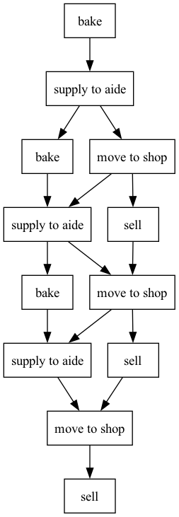
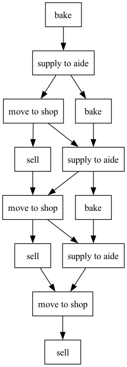

# Heraklit Equivalence Checker

This tool checks whether one Heraklit run is a prefix of or equivalent to another. It can be used to verify that 
1. the steps used to model a system can properly model a system, and
2. next step predictions match the actual next steps, even under concurrency and non-determinism

## Usage

The tool requires step definitions in the format described below, and two runs to compare. It will then check whether the second run is a prefix of the first.

Use [uv](https://docs.astral.sh/uv/getting-started/installation/) to run the scripts.

```
uv run checker.py --step-defs <step_definitions_file> --reference-run <reference_run_file> --checked-run <checked_run_file>
```

The last output will be whether there was a match or not, previous output might hint as to why matching failed.

The checker might output warnings (see below, `X` is a placeholder). 

<details>

<summary>Initial step X is not contained in the reference graph</summary>

This message before a `no match` means that there was an additional unconnected step that did not appear in the reference run.

---

</details>

<details>

<summary>Step X is not defined in the step definitions</summary>

A run contains a step that has not been defined in the step file definition. 

Make sure to separate step names in your runs by commas.

---

</details>

<details>
<summary>Warning: place X is a left place of step but is not consumed by any step</summary>

This warning hints at steps that have unconnected left places. This is not concerning if these places can be considered initial places. 

If there are too many free left places, it might be a hint that the steps are not modelled correctly or the runs do not fit the step structure.

---

</details>

## Step Definition Format

The step definitions are provided in a JSON file. See `tests/step_defs/` for example files.

Sample file:

```json
[
    {
        "name": "bake",
        "left_places": ["ready to bake"],
        "right_places": ["on counter"]
    },
    {
        "name": "supply to aide",
        "left_places": ["on counter", "aide free"],
        "right_places": ["ready to bake", "aide busy"]
    },
    {
        "name": "move to shop",
        "left_places": ["aide busy", "shelf empty"],
        "right_places": ["aide free", "on shelf"]
    },
    {
        "name": "sell",
        "left_places": ["on shelf"],
        "right_places": ["shelf empty"]
    }
]
```

## Run File Format

A run consists on a series of step names, separated by commas. Any excessive space characters before/after the step name are trimmed away. 

A run of the previous steps could be

```
bake, supply to aide, move to shop, sell, bake, supply to aide, bake, move to shop, sell, supply to aide, move to shop, sell
```

## Displaying the extracted run graphs

Run with `--display`, after doing `uv add graphviz` to install the graph visualization library. This can help understand how the tool combines the runs.

The files output will be `reference_graph.png` and `checker_graph.png`.

The graphs will look similar to these extracted from `tests/bakery_complex.test`:


| Bakery Graph 1 | Bakery Graph 2 |
| --- | --- |
|  |  |


## Tests

To run the tests, use `uv run tester.py`. To pause on a failing test and display the graphs, use `uv run tester.py --display-failed`. The tests are located in the `tests/` directory. Each test consists of a step definition file in the first line, the expected result in the second line and the two runs (reference and checked) in the two following lines. 

The expected result can be `match`, `no match` or `error`. The first two indicate whether the second run is a prefix of the first, while `error` indicates that the tool should raise an error, for example due to invalid step definitions.

To only run specific tests, run with `--run-only <test_name_element>`, which will run all tests with file names containing `<test_name_element>`. (This in combination with `--display-failed` can be used to see the graphs of a single test without failure as a file)

## Use as a library

The functionality is contained in the `checker.py` file, which can be imported and used in other Python code. The main function to use is `check_equivalence_step_file`, which takes the two runs and the path to the step definitions file as an argument and returns whether the first run is a prefix of the second.

